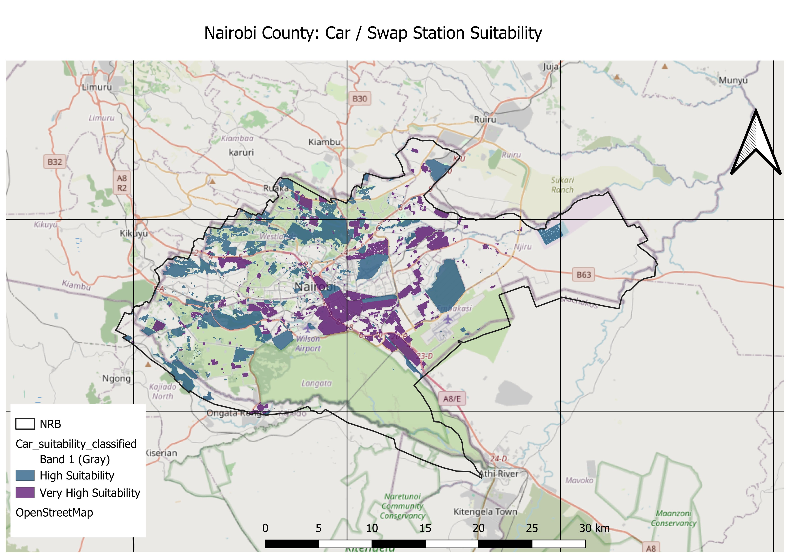
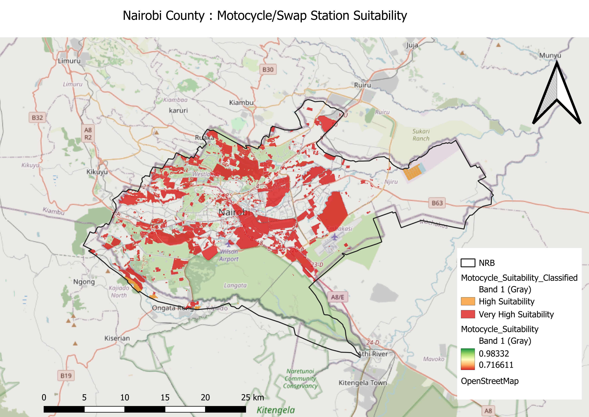

# Nairobi EV Charging & Swap Station Site Selection

AHP-weighted multi-criteria suitability analysis identifying optimal locations 
for EV charging (cars) and battery swap stations (motorcycles/tuk-tuks) 
in Nairobi County, Kenya.

## Methodology
- **Data:** OpenStreetMap (roads, POIs, land use, power infrastructure) via HOT Export Tool
- **Criteria:** road proximity, grid/power proximity, fuel station proximity, 
  matatu/bus stop proximity, commercial hub proximity, land use suitability
- **Weighting:** Analytic Hierarchy Process (AHP) with separate pairwise 
  comparison matrices for cars vs. motorcycles (Consistency Ratio < 0.02 for both)
- **Tools:** QGIS (raster processing, distance analysis, weighted overlay), 
  Excel (AHP calculations)

## Results

## Key Finding
Suitability is concentrated in Nairobi's already-developed urban core, 
reflecting existing infrastructure density (roads, power, commercial activity). 
This suggests near-term siting priority should focus on optimizing placement 
within these zones, while rural fringe areas would require infrastructure 
investment before becoming viable.

## Files
- `Car_Suitability_Map.jpeg` / `Motorcycle_Suitability_Map.jpeg` — final suitability maps
- `Motocylcle_Swap station AHP.csv` — AHP pairwise comparison matrix and weight calculations
- `Nairobi_EV_Siting.qgz` — full QGIS project file
